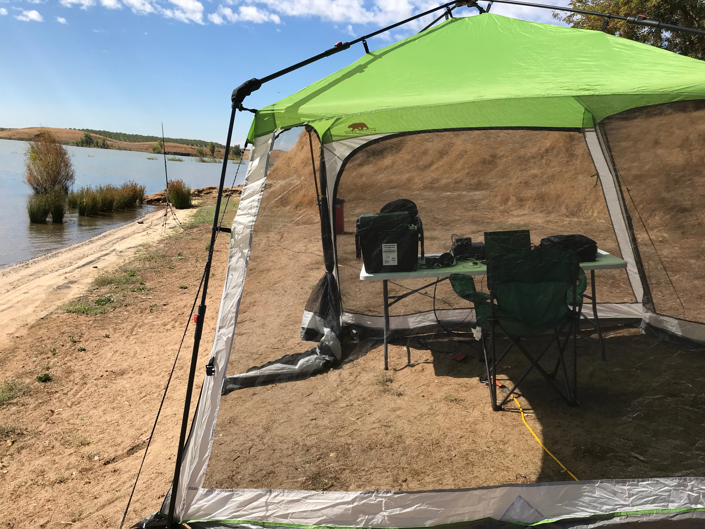
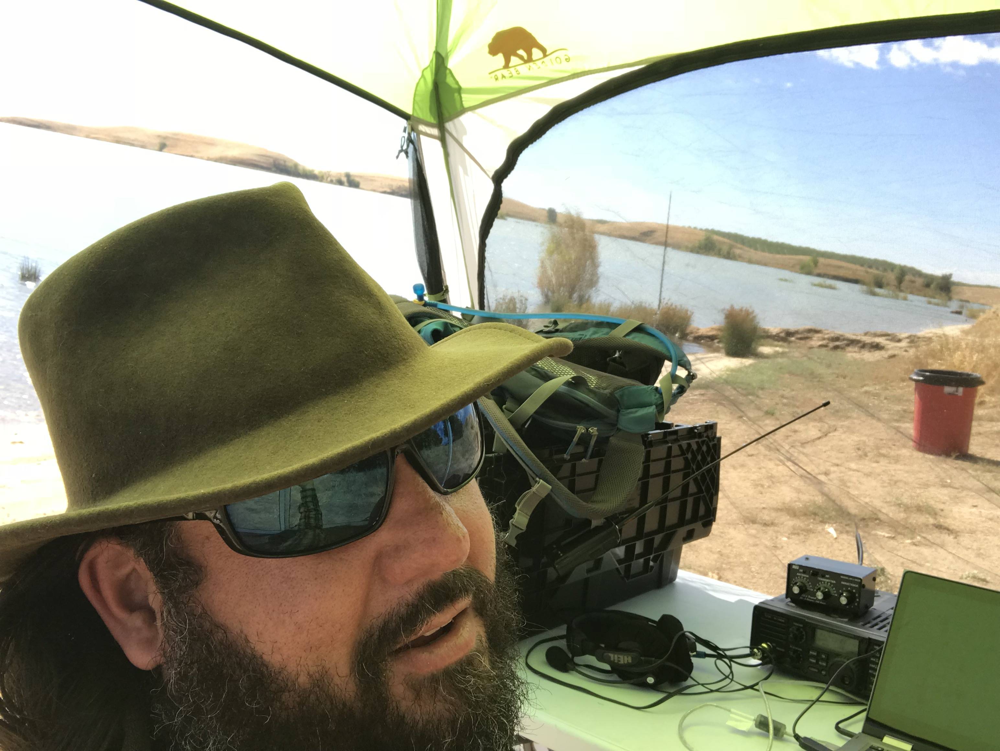
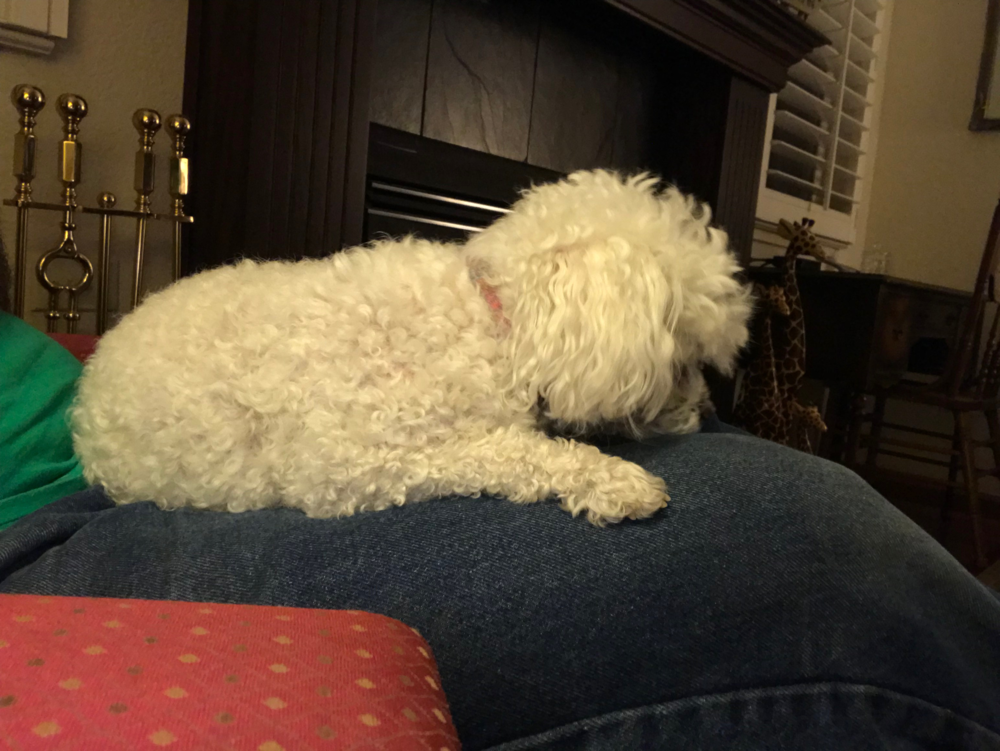
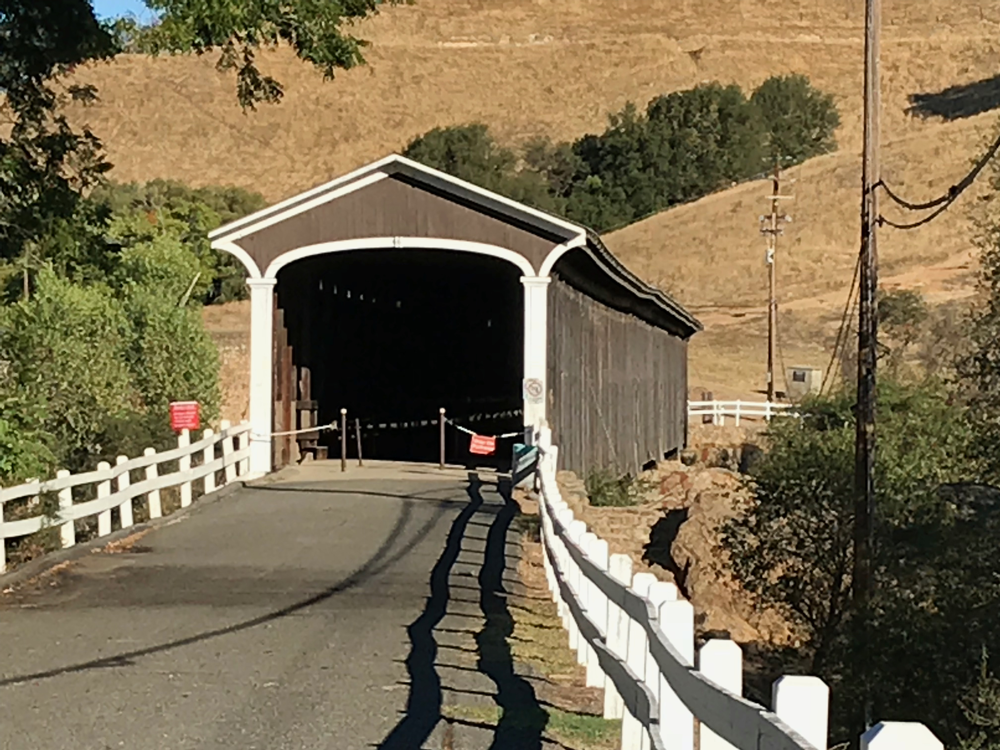
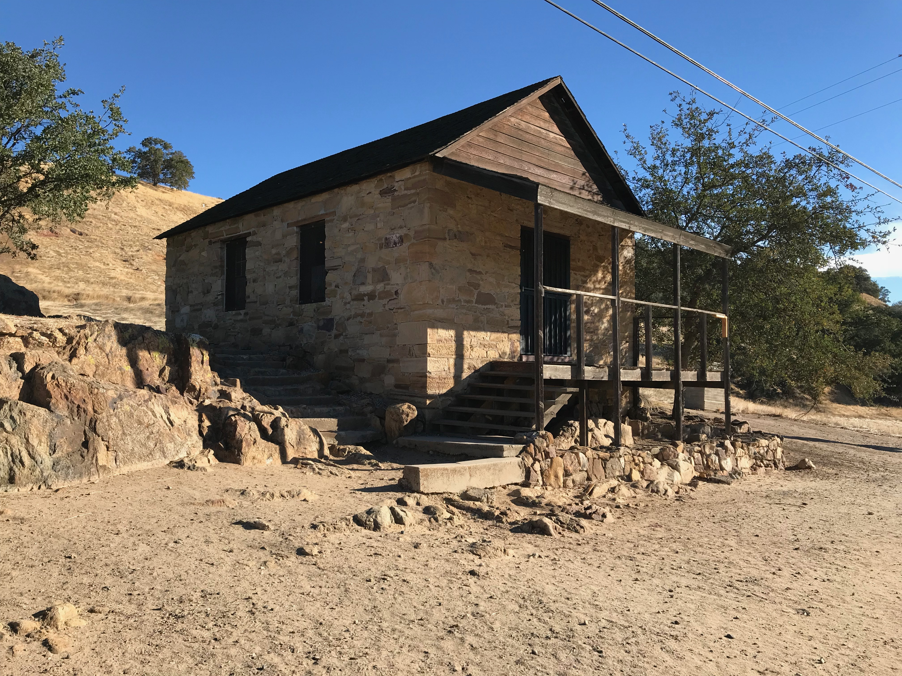
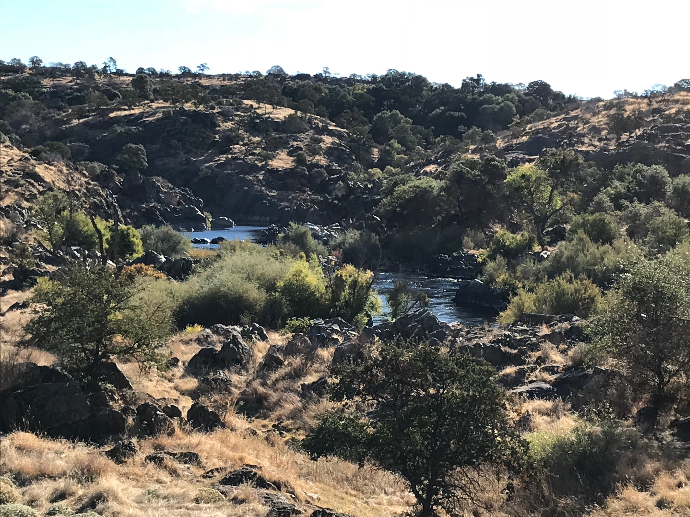
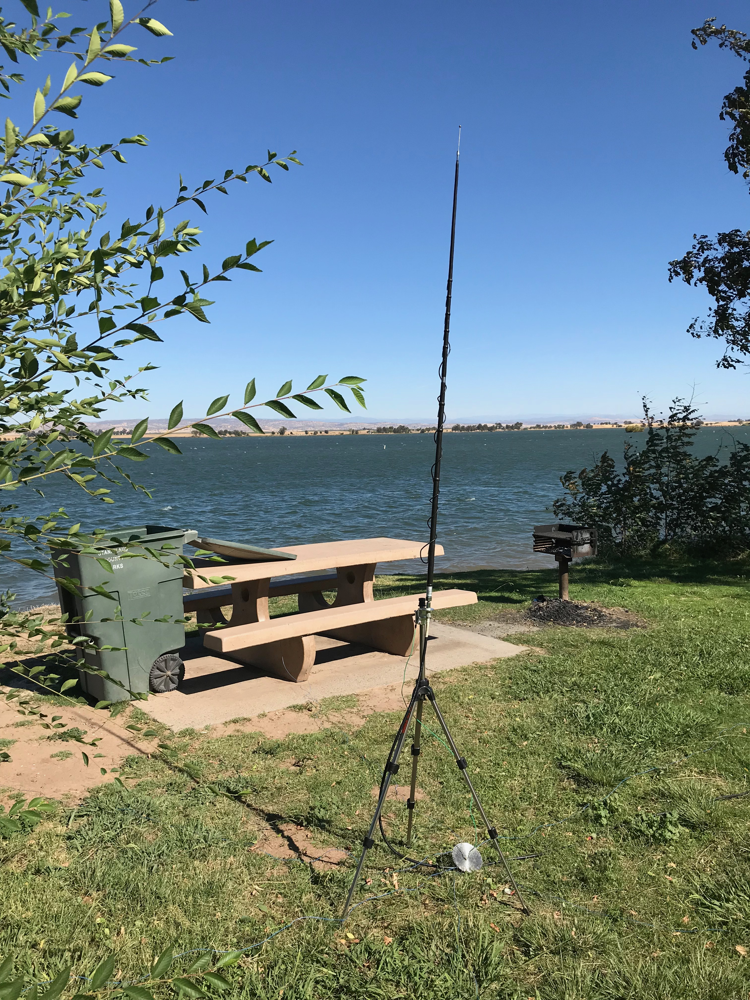
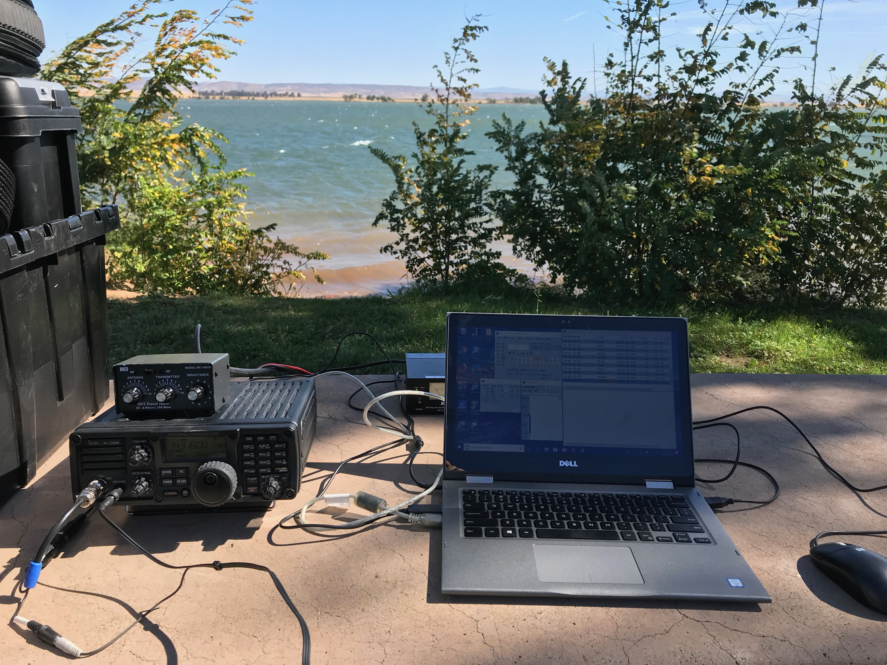
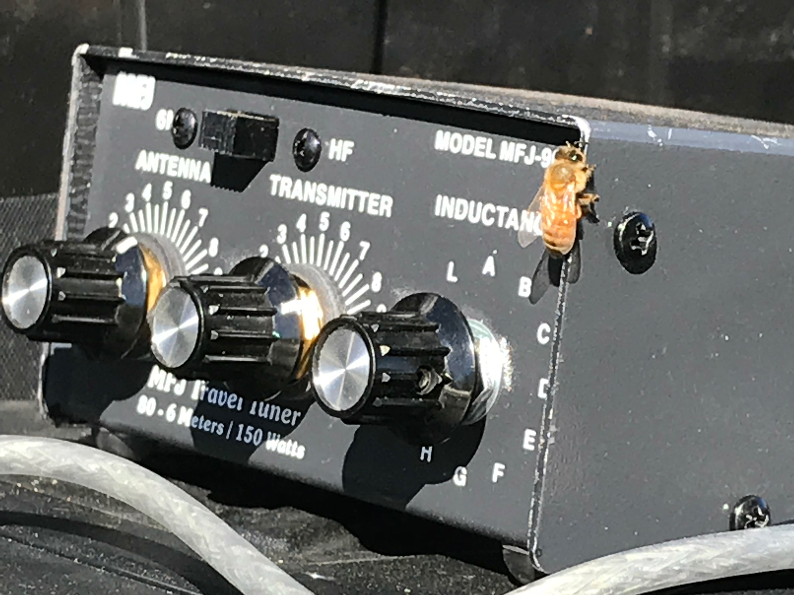

= Tales from Solo Portable Operations
:Author: Tony Monroe W6SFI
:Date: October 2018
:backend: slidy
:badges:
:icons:
:linkcss:
:stylesheet: user.css
:title-image: img/qsl1.png
:subtitle: California QSO Party 2018
:conference-sponsor: South Bay Amateur Radio Association
:conference-title: General Meeting
:conference-dates: Month Year
:favicon: favicon.ico

== Primary Objectives

[role="incremental"]
- Give out a relatively rare county to out-of-state contesters
- Operate at moderate power in a low-noise natural setting
- Learn lessons for future portable operations
- A satisfying number of QSOs
- Enjoy a weekend out of the house!  But not too far out.

== Targets of Opportunity

[role="incremental"]
- Celebrate being a life-long California resident
- A large number of QSOs
- More running time than search-and-pounce time
- Bum some overnight crash space from my parents :-)
 
== What to Avoid

[role="incremental"]
- Operating QRP, or effectively so
- 100% search-and-pounce time
- Angry park rangers
- Losing my voice
- Injuries and illnesses
- Wildfires

== Selecting Locations

One week before the event I visited http://cqp.org/ and looked for
unclaimed counties.

[role="incremental"]
- Hm, Stanislaus and Yolo aren't claimed yet...
- I drive through northeastern Stanislaus County whenever I visit my parents...
- I wonder if the contest organizers know any operating spots?

== Mail from More Experienced Operators

[role="incremental"]
[quote, Bob N6TV]
Any ideas Alan?

[role="incremental"]
[quote, Alan AD6E/KH6TU]
I took a quick look at Google Earth, and there seems to
be a nice little park called Orange Blossom Recreation Area about 4
miles east of Oakdale...GL, I'm going to need STAN myself this time.

[role="incremental"]
[quote, Glen W6GJB]
Tom,
Glad to hear you will going to
Stanislaus...Maybe someone on the email list will have a suggestion
for a good location.

[role="incremental"]
Tom?  Who's Tom?!

== Equipment

[role="incremental"]
- ICOM IC-7200 transceiver, covering 160m-6m
- MFJ-902B transmatch
- Outbacker 500 vertical, covering 75m-10m
- Extremely Sophisticated *(cough)* Radial System
- Modified camera tripod
- Laptop computer with N1MM
- Borrowed generator
- Shade tent
- Folding table
- Folding chair
- Toolbox
- Overnight bag
- 2011 Volkswagen Jetta TDI Sportwagen, without emissions modification

== Scouting Saturday: Turlock Lake

- East of Modesto on CA-132
- A (metaphorical) stone's throw from the Tuolumne River

image::img/modesto-turlock-sra-map.png[width=1024,link="img/modesto-turlock-sra-map.png"]

== Scouting Saturday: Turlock Lake

[role="incremental"]
* Northwest shore of lake, southeast corner of CM97qp
* Narrow strip of beach with lots of parched grass nearby
* Power lines across the road
* Not really flat and level
* Almost completely exposed to the elements

image::img/turlock-sra-north-shore.png[width=1024,link="img/turlock-sra-north-shore.png"]

== Scouting Saturday: Turlock Lake

A local grandmother who brought her two grandchildren said the lake
was very full!

image::img/turlock-lake-panorama.jpg[width=1024,link="img/turlock-lake-panorama.jpg"]

== Setting Up Saturday: Turlock Lake

[role="incremental"]
* Weather was pleasant, partly cloudy and breezy...
* ...but setup was a drag!
* I didn't have suitable stakes for sandy ground.
* Of all the tools in the world, why did I forget a hammer to drive the stakes that I did have?
* Too many trips on a sloped path between the beach and the car, without a wagon or dolly.

image::img/turlock-shade-tent.jpg[width=1024,link="img/turlock-shade-tent.jpg"]

== Operating Saturday: Turlock Lake

But we're here to operate, so let's operate!

== Operating Saturday: Turlock Lake

My antenna and Extremely Sophisticated *(cough)* Radial System.

image::img/turlock-radial-system.jpg[height=768,link="img/turlock-radial-system.jpg"]

== Saturday Operating Summary
[role="incremental"]

* Noisy all day (S4-S5 on 15 and 20 meters).  Was it the power lines or the generator?
* 40 meters was useless (S9 noise floor).
* Chair was perhaps better for tailgating than operating.
* Teardown was faster than setup but possibly more of a drag...
* ...because my car was up a hill and I didn't have a wagon!

== Relaxing Saturday Evening

Dog tax!  Meet Misty, my parents' 8-pound toy poodle, who wouldn't
smile for the camera.

== Sightseeing Sunday: Knights Ferry

[role="incremental"]
- East of Oakdale on CA-108/CA-120, straddles CM97pt and CM97qt
- One of the Stanislaus River parks.  https://www.stanislausriver.com/parks/
- Longest covered bridge west of the Mississippi River!
- Former grain mill and hydroelectric generator station.
- Popular site for river rafters to put in, but possibly not that day

== Sightseeing Sunday: Knights Ferry

The covered bridge, viewed from the south end.

== Sightseeing Sunday: Knights Ferry

The office building across the path from the mill.

== Sightseeing Sunday: Knights Ferry

Panorama of the bridge, from underneath on the west side.

image::img/knights-ferry-bridge-panorama.jpg[width=1024,link="img/knights-ferry-bridge-panorama.jpg"]

== Sightseeing Sunday: Knights Ferry

Looking up the Stanislaus River in the morning.

== Scouting Sunday: Orange Blossom Park

[role="incremental"]
* A few miles east of Oakdale, on the north side of the Stanislaus River.
* Northeast corner of CM97os
* Right next to the river, but basically in a valley.
* Nice place for a picnic, but possibly not for daytime HF operating.

== Scouting Sunday: Woodward Reservoir

A few miles north of Oakdale on county highway J14. Takes up a lot of CM97nu.

image::img/oakdale-woodward-res-map.png[width=1024,link="img/oakdale-woodward-res-map.png"]

== Scouting Sunday: Woodward Reservoir

So where to operate here?

[role="incremental"]
* Road to peninsula in the middle of the reservoir was closed.
* How about picnic areas on the west shore?
* Definitely more flat and more level than yesterday!
* Green grass, shade trees, concrete picnic tables...
* ...but very windy today.  Maybe we can make use of bushes and trees.

image::img/woodward-res-west-shore.png[width=1024,link="img/woodward-res-west-shore.png"]

== Setup Sunday: Woodward Reservoir

[role="incremental"]
* Setup was easier than yesterday!
* Table, seating, and shade were already provided.
* Used another table to block acoustic and possibly RF noise from the generator.
* Used a bush to shield the antenna from the stiff wind!

== Setup Sunday: Woodward Reservoir

Flimsy camera tripod not falling over in the wind, thanks to a nearby bush.

== Operating Sunday: Woodward Reservoir

The antenna hasn't fallen over yet, let's try some operating!

== Operating Sunday: Woodward Reservoir
No visitors all day!  Well, almost.

== Sunday Operating Summary

[role="incremental"]
* Noise floor was much lower, S0.  Easier to make those contacts!
* Got most of my contacts for the contest from calling CQ on 21373 and holding it for a lot longer than I expected!
* No pileup, but it was fun to be a wanted station.
* Maybe this solo portable operating thing is really a thing!
* Teardown was only about 15 minutes.  Back home within 3 hours of contest end.

== Log Summary

[role="incremental"]
- 85 QSO
- 30 on Saturday, 55 on Sunday
- 35 on 20m, 49 on 15m
- 84 phone, 1 CW
- 84 out-of-state, 1 in-state -- very weak and in same county

link:map.html[Map of completed QSOs]

== Log Highlights
[role="incremental"]
- 36 QSO in 55 minutes from running on 21373 on Sunday :-)
- Stopped running when only Tennessee was answering, and not often.
- Made it as far as Alaska, Maine, and Florida.
- Nothing off-continent.  Where were Hawaii and Japan? :-(
- About a dozen "thanks for the new county" :-)

== Lessons Learned: Tools

[role="incremental"]
* Should have made a packing list and worked from it.
* Shade tent was a good idea.  Even better when you don't need it!
* Should have brought a hammer for stakes.
* Should have brought corkscrew sand stakes.
* Should have brought a wagon to make hauling gear easier.

== Lessons Learned: Antenna

[role="incremental"]
* Vertical antenna low to the ground got good distance...
* ...but in-state was very difficult!
* Holy Skip, Batman!  Out of state, nothing closer than Colorado.
* Should have brought an NVIS dipole to get most of 6- and 7-land.
* Unknown if Extremely Sophisticated *(cough)* Radial System had any effect.  It probably didn't hurt.

== Lessons Learned: Power

[role="incremental"]

- Generators are useful but noisy and smelly and fussy.
- For daylight-only operations with 100 watts, a battery and solar setup should be sufficient.
- For less than 5 hours per day at 100 watts, a big battery should be sufficient.

== Lessons Learned: Location
[role="incremental"]
* Visiting ahead of time is invaluable, but not always possible (day use fees).
* Prior research with a web browser can help.  link:https://www.google.com/maps/[Google Maps] link:https://www.openstreetmap.org/[OpenStreetMap] link:https://www.google.com/earth/[Google Earth]
* Hilltops covered with parched grass are not attractive to generator users.
* Convenient bushes can help flimsy verticals remain upright on windy days...
* ...but a weight system is probably a better idea!
* Operating portable can help you meet the locals...
* ...if any locals are out and about.

== Lessons Learned: Operating

[role="incremental"]
* Should have set up recordings to save my voice, at least for calling CQ.
* Calling CQ in an empty spot on 15 meters got me most of my QSOs...
* ...until all I got was a thin stream of Tennessee, and then it was time to change tactics.
* N1MM is actually good software. :-O
* Being a desirable station can be fun!

== Back Matter

This presentation was written in http://asciidoc.org/[AsciiDoc] and
presented with http://www.w3.org/Talks/Tools/Slidy2/[Slidy].

Presentation source code: https://github.com/tnalpgge/presentations/tree/master/cqp-2018

Map page source code: Not public yet.  Maybe some day!

Link to presentation: https://tnalpgge.github.io/presentations/cqp-2018/

== Any Questions?

== QRT
[role="cw"]
TNX 73 ES GL

https://creativecommons.org/licenses/by-nc-sa/4.0/
